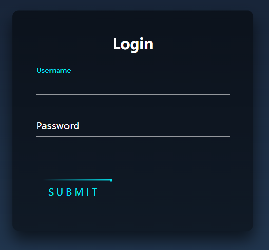
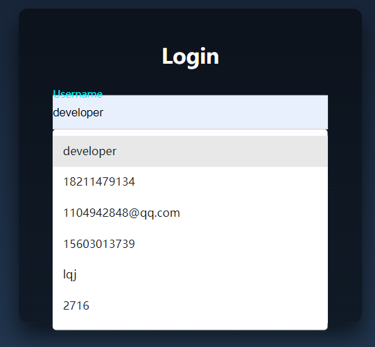

# front-end-demos

- 关于前端的一些小型的demo和设计等

# 一些笔记

## 01-登录表单

- 在登录表单中的用户名框中，如果不设置 input 框的 name 属性

  

- 如果设置了 name 属性为 username，会出现提示输入框，然后影响样式布局

  

> name 属性规定 input 元素的名称。
> name 属性用于对提交到服务器后的表单数据进行标识，或者在客户端通过 JavaScript 引用表单数据。
> 注释：只有设置了 name 属性的表单元素才能在提交表单时传递它们的值。

```html
<form>
  <!-- 用户名 -->
  <div class="user-box">
    <input type="text" name="username" required="" />
    <label>Username</label>
  </div>
  <!-- 密码 -->
  <div class="user-box">
    <input type="password" name="" required="" />
    <label>Password</label>
  </div>
  <a href="#">Submit</a>
</form>
```

##
